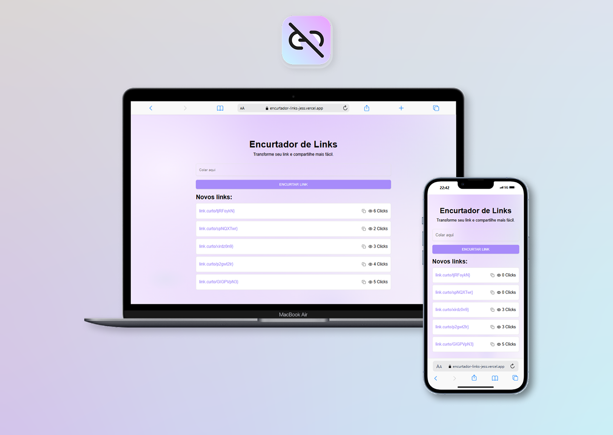

# Encurtador de Links

Este é um projeto full stack que transforma URLs longas em links curtos e fáceis de compartilhar. Desenvolvido para aplicar e demonstrar conhecimentos em tecnologias modernas, como **Next.js, Node.js e React**, o sistema oferece uma solução prática para o gerenciamento e compartilhamento de links.

[](https://encurtador-links-jess.vercel.app/)

**Desenvolvimento Full Stack** \
[**Encurtador de Links**](https://encurtador-links-jess.vercel.app/) • Acesse o projeto \
Linguagem: `TypeScript`,\
Front-end: `Next.js`, `React`, `Tailwind Css`,\
Back-end: `Node.js`, `Express.js`, `Prisma`,\
Banco de Dados: `PostgreSQL`,\
Mais projetos: [Portfólio](https://jessdebrito.com/)

## Prévia
[](https://encurtador-links-jess.vercel.app/)


<br/><br/>
## Iniciar projeto 🚀

Caso queira contribuir com este repositório, basta clonar e criar uma nova branch:
```bash
git clone https://github.com/jessdebrito/encurtador-links.git
```

```bash
git checkout -b feature/NAME
```

Não se esqueça de iniciar o node
```
npm i
```

Para rodar o projeto:
```
npm run dev
```

Encontre-me no [LinkedIn](https://www.linkedin.com/in/jessica-de-brito/) caso tenha qualquer dúvida.
